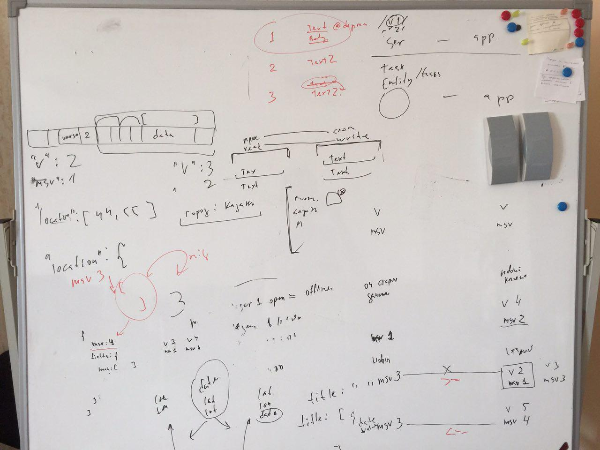
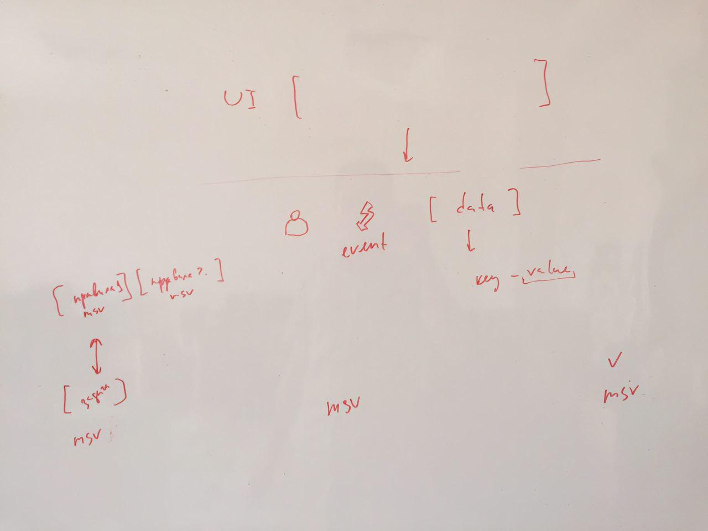

== О версионировании

Реализация такая, что задачи версионируются отдельно от сервера.
Каждая задача версионируется отдельно.
И если она создана в старой версии то с ней работают в старом стиле, до тех пор пока клиенты это поддерживают.
Или до тех пор, пока не будет произведена миграция данных.

=== Данные по задаче

Каждое поле-данных версионировать не будем.
Версионируем всю задачу. Каждая задача имеет поле mcv

[source,json]
----
{
  "mсv":2
}
----

mcv - Minimal compatibility version

mcv = N
Воспринимать так: Это поле состоит из полей и данных, чья структура удовлетворяет по меньшей мере структуре,
которая запротоколирована в версии api = N. Поэтому минимальная версия клиента, который может прочесть эту задачу это >= N

Версия поднимается, когда вносим изменения нарушающие совместимость(чтобы сделать Api лучше)

=== Мобильный клиент

он также имеет v и mcv -  свою текущую версию и минимально поддерживаемую версию. +
Отталкиваясь от сочетания этих полей с полем mcv задачи получаем возможность контролировать следующее:
* чтоты старые клиенты не открывали новые задачи с неизвестной им структурой
* чтобы новые клиенты не открывали совсем старые задачи, со структурой, которую уже исключили из своей кодовой базы.

=== Краевые ситуации:

старый клиент - новые данные +
v-3 mcv-2 vs mcv-4
Клиент проверяет v(клиент)>=mcv ? -нет, задачу прочесть не может, предлагает обновиться

новый клиент - старые данные
v-3 mcv-2 vs mcv-1
Клиент проверяет v(клиент)>=mcv ? - да, верхняя граница поддерживается(в задаче нет чего-то нового о чем я не знаю)
mcv(клиент)<=mcv ? нет, клиент уже выпилил из себя код версии 1, поэтому задачу прочесть не может - надо запустить тулзу мигрирования задачи.

=== Файлы обсуждений

